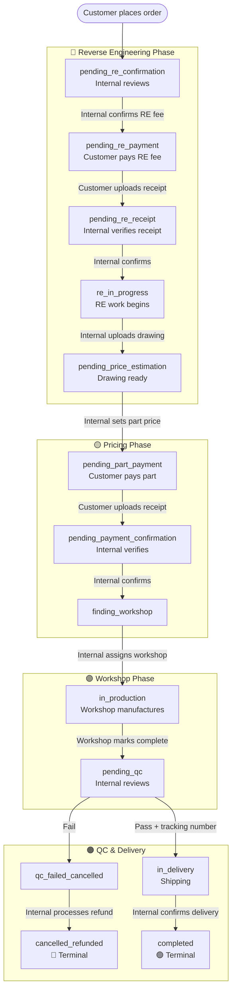
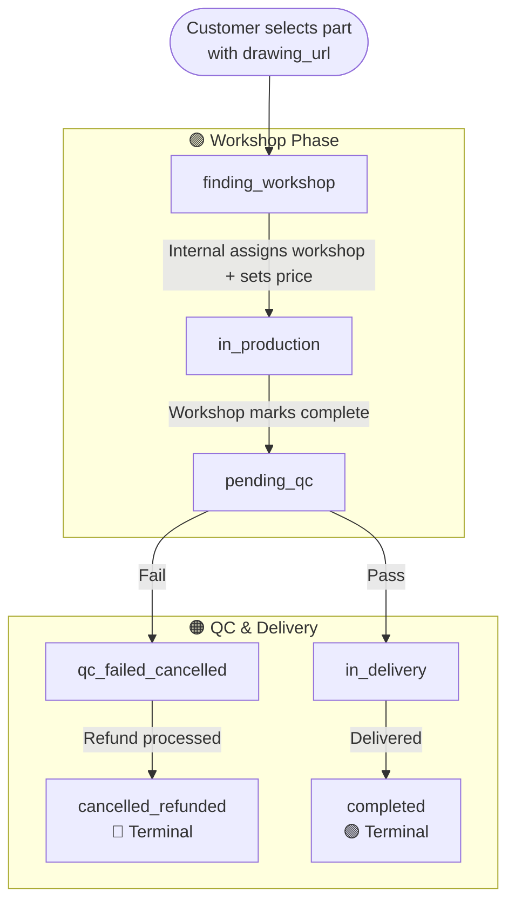
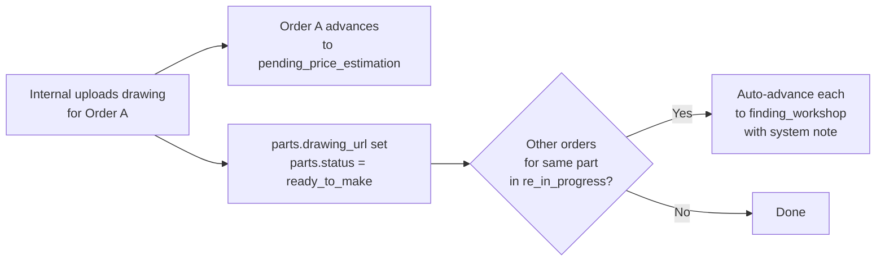
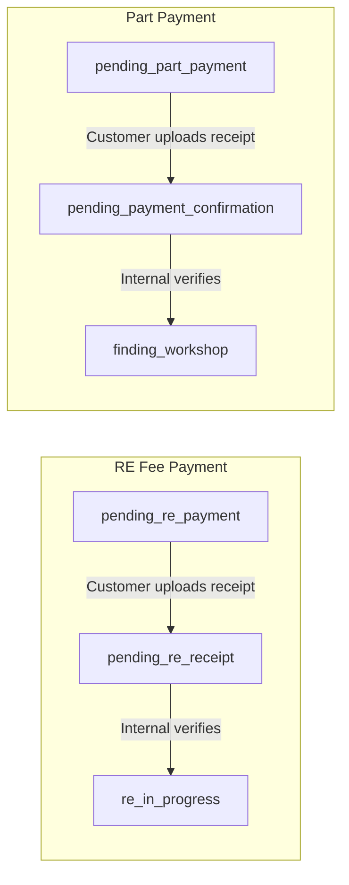
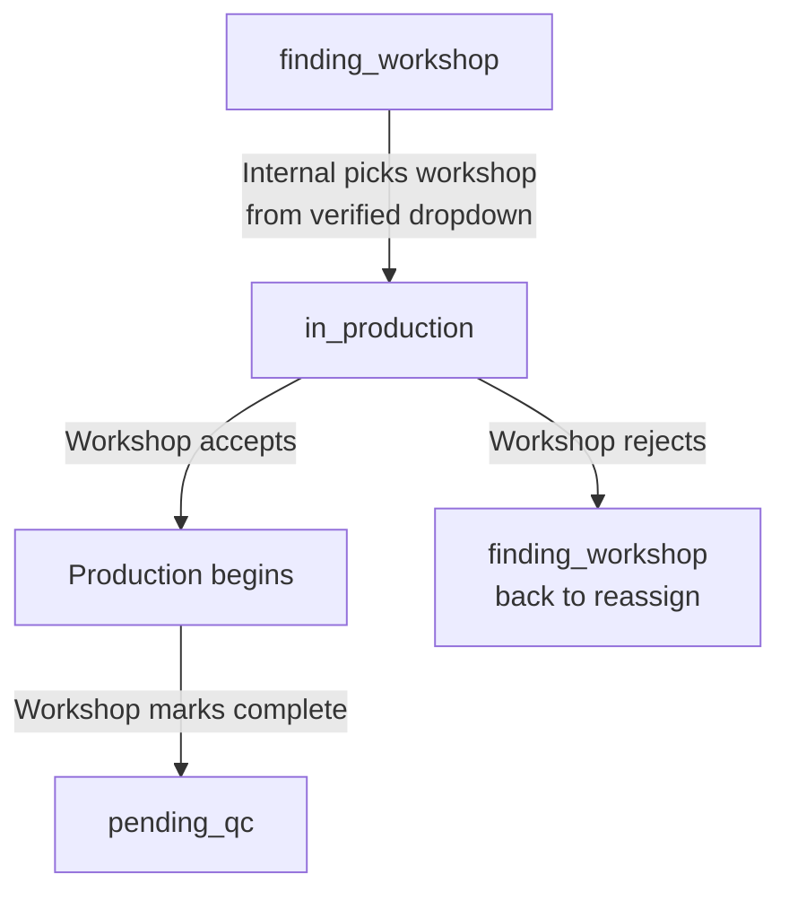
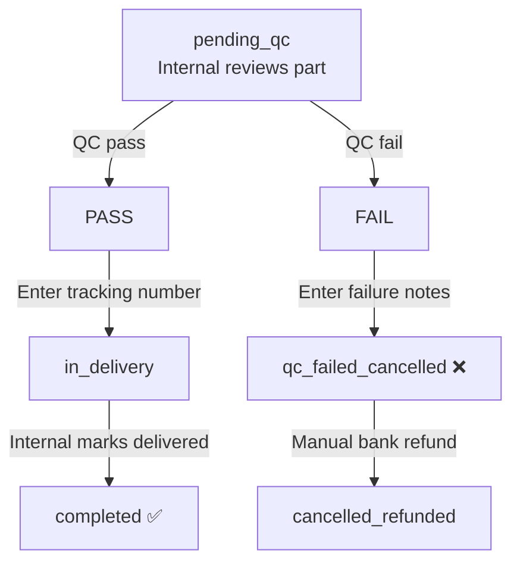
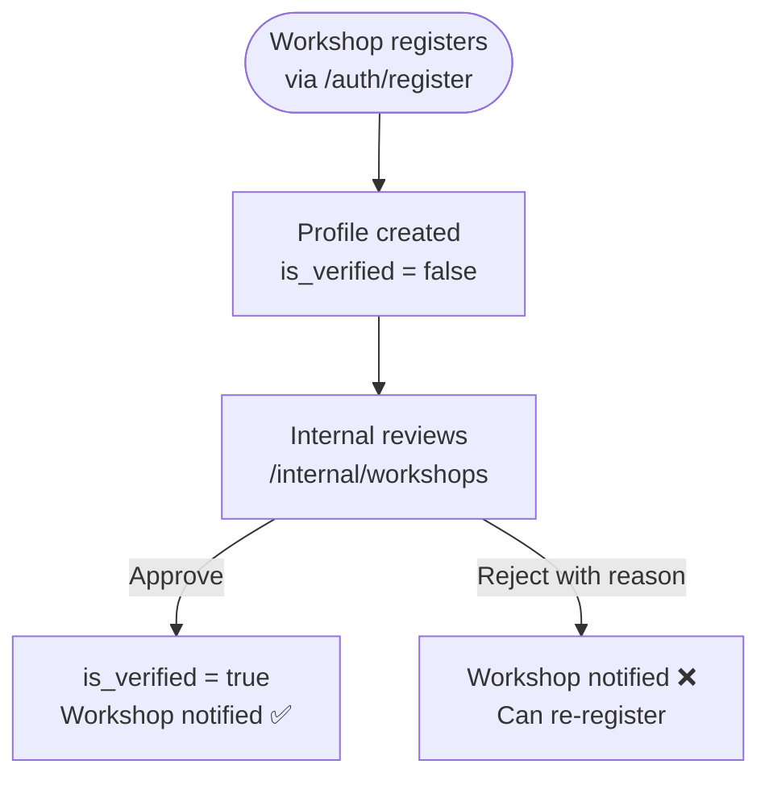

# PartBank — Order Flows

All order flows are driven by a 14-status state machine in `lib/actions/orders.ts`.  
Every status transition creates a notification for the relevant party.

---

## The Two Order Paths

```
Customer places order
        │
        ├── Part has drawing_url? ──Yes──► Ready-to-Produce Flow
        │                                  (starts at finding_workshop)
        └── No ──────────────────────────► RE Flow
                                           (starts at pending_re_confirmation)
```

---

## 1. Main Flow — Full RE Path

For parts without a technical drawing. Goes through Reverse Engineering first.



---

## 2. Ready-to-Produce Flow

For parts that already have a technical drawing (`drawing_url` is set on the part).  
Skips the entire RE + pricing phase — starts directly at workshop assignment.



**What changes on the customer side:**
- Part detail page shows "Ready to produce" badge (green)
- New order page shows 3-step flow (no RE step) + "3–7 business days" turnaround
- Order form hides the reference photo upload
- No RE fee, no drawing upload wait

---

## 3. Drawing Upload & Auto-Advance

When Internal uploads a technical drawing for an RE order, the system does three things atomically:



This prevents duplicate RE work when two customers order the same unknown part simultaneously.

---

## 4. Payment Flows

Two separate payment loops exist — RE fee and part payment. Both follow the same receipt pattern.



**How receipts work:**
- Customer uses `UploadReceiptForm` → file goes to `receipts` storage bucket
- A record is created in the `files` table (`file_type: re_receipt | part_receipt`)
- Internal sees a "View Receipt" link in the order action panel
- Internal manually verifies the bank transfer and clicks confirm

---

## 5. Workshop Assignment Flow



**Details:**
- Only `is_verified = true` workshops appear in the assignment dropdown
- Workshop receives an in-app notification on assignment
- Workshop can accept or reject from their order detail page
- Rejection returns the order to `finding_workshop` for Internal to reassign
- Technical drawing becomes visible to the workshop from `finding_workshop` onwards

---

## 6. QC Flow



**QC failure is terminal** — no re-production loop in MVP.  
After `qc_failed_cancelled`, Internal manually refunds the customer outside the platform, then clicks "Refund Processed" to move to `cancelled_refunded`.

---

## 7. Workshop Registration & Approval

Separate from the order flow — governs whether a workshop can receive orders.



Only verified workshops appear in the order assignment dropdown.

---

## 8. Complete Status Reference

| Status | Who acts | Actor |
|---|---|---|
| `pending_re_confirmation` | Waiting for Internal to confirm RE | 🔵 Internal |
| `pending_re_payment` | Waiting for Customer to pay RE fee | 🟢 Customer |
| `pending_re_receipt` | Waiting for Internal to verify receipt | 🔵 Internal |
| `re_in_progress` | RE team working | 🔵 Internal |
| `pending_price_estimation` | Waiting for Internal to set price | 🔵 Internal |
| `pending_part_payment` | Waiting for Customer to pay | 🟢 Customer |
| `pending_payment_confirmation` | Waiting for Internal to verify | 🔵 Internal |
| `finding_workshop` | Waiting for Internal to assign | 🔵 Internal |
| `in_production` | Workshop manufacturing | 🟡 Workshop |
| `pending_qc` | Waiting for Internal QC | 🔵 Internal |
| `qc_failed_cancelled` | Waiting for Internal to process refund | 🔵 Internal |
| `cancelled_refunded` | **Terminal — cancelled** | — |
| `in_delivery` | Waiting for Internal to confirm delivery | 🔵 Internal |
| `completed` | **Terminal — success** | — |
